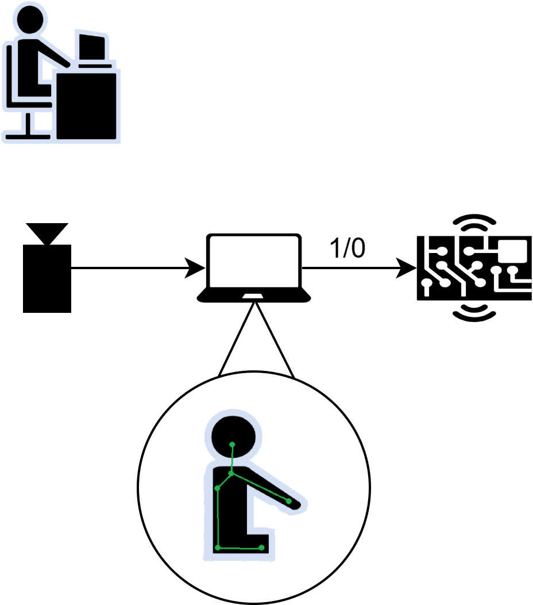

# Posture Detection System with Image Recognition

**Authors:** Hugo Centeno, Alfonso Mayoral & Lauren Gallego  
🏆 *3rd Place Winner at BearHack, University of California Riverside – April 5, 2025*

## Problem & Solution

As students, we all suffer from back pain after long study sessions due to incorrect posture.

We propose a real-time image detection system that alerts the user when their posture is incorrect.

## Implementation

This project uses the [MediaPipe](https://mediapipe.dev/) library to create a real-time posture monitoring system using a webcam or video feed.

Initially, key nodes are placed on body parts such as the neck and torso. Straight lines are then computed to connect these nodes. Posture is evaluated based on the angle formed by these lines—certain angles are classified as “good” or “bad.”

The script communicates with an Arduino UNO. If the posture is detected as bad, a red LED lights up and a buzzer sounds to alert the user. When the posture is corrected, the LED turns green.

After each session, the user receives a report showing how much time was spent in good vs. bad posture, along with additional insights.

## Demo

🎥 [Watch Demo on YouTube](https://youtu.be/0CwbkUt7-jk)

## Notes

The model used was adapted from [mecantronic/posture-monitor](https://github.com/mecantronic/posture-monitor), with slight modifications.
